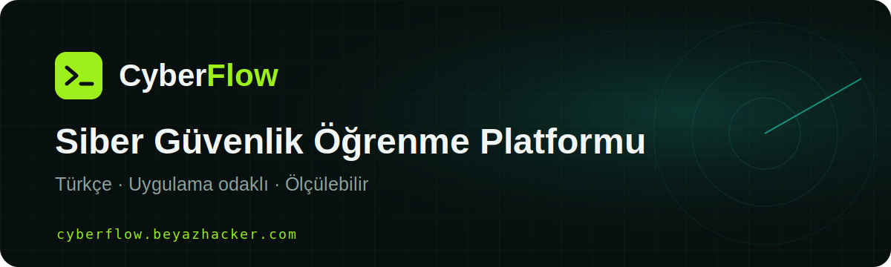

# CyberFlow

### Yeni Nesil Türkçe Siber Güvenlik Öğrenme Platformu

Siber güvenlik öğrenimini erişilebilir, ölçülebilir ve uygulama odaklı hâle
getiren bağımsız bir eğitim platformu.

## Platform istatistikleri

<!-- CYBERFLOW_STATS_START -->

> İstatistikler 28 Haziran 2026 tarihinde Firestore üzerinden anonim ve toplu
> olarak güncellenmiştir.

|  | Güncel değer |
|---|---:|
| 👥 Kayıtlı kullanıcı | **793** |
| 🧠 Öğrenme içeriği | **8.059** |
| ✅ Tamamlanan öğrenme etkinliği | **2.667** |
| 🛡️ CVE kaydı | **1.577** |
| 🎓 Kurs | **50** |
| 🧭 Kariyer yolu | **10** |

### İçerik dağılımı

| Eğitim | Blog | Video | Test | CTF |
|---:|---:|---:|---:|---:|
| 2.717 | 3.360 | 795 | 680 | 507 |

### Topluluk etkinliği

| Tamamlanan eğitim | Blog | Video | Test | CTF |
|---:|---:|---:|---:|---:|
| 2.041 | 32 | 549 | 43 | 2 |

<!-- CYBERFLOW_STATS_END -->

## CyberFlow nedir?

CyberFlow; öğrenme içeriklerini, uygulamalı testleri, CTF çalışmalarını,
kariyer yollarını ve güncel güvenlik verilerini tek platformda birleştiren
Türkçe bir siber güvenlik öğrenme ekosistemidir.

Platformun amacı yalnızca bilgi sunmak değil; kullanıcıların ilerlemelerini
ölçebildiği, eksik alanlarını görebildiği ve düzenli pratik yapabildiği bir
öğrenme deneyimi oluşturmaktır.

## Proje yaklaşımı

- Türkçe ve erişilebilir siber güvenlik eğitimi
- Teoriyi uygulamayla birleştiren öğrenme deneyimi
- Ölçülebilir ilerleme ve kategori bazlı gelişim
- Etik, yasal ve savunma odaklı kullanım
- Kişisel veri içermeyen şeffaf platform istatistikleri

## Teknoloji

`Flutter` · `Dart` · `Firebase Authentication` · `Cloud Firestore` ·
`Cloud Functions` · `Firebase Hosting`

## Bağlantılar

- [CyberFlow web sitesi](https://cyberflow.beyazhacker.com)
- [100 soruluk Türkçe CEH deneme sınavı](https://cyberflow.beyazhacker.com/ceh-deneme-sinavi)
- [Türkçe CEH çalışma rehberi](https://github.com/pcdunyasitv/cyberflow-turkce-ceh-calisma-rehberi)

## Gizlilik

Bu sayfada yalnızca toplu sayaçlar yayımlanır. Kullanıcı adı, e-posta adresi,
IP adresi, sıralama bilgisi veya tekil kullanıcı hareketi paylaşılmaz.

---

**Öğren · Uygula · Geliş**

[cyberflow.beyazhacker.com](https://cyberflow.beyazhacker.com)

